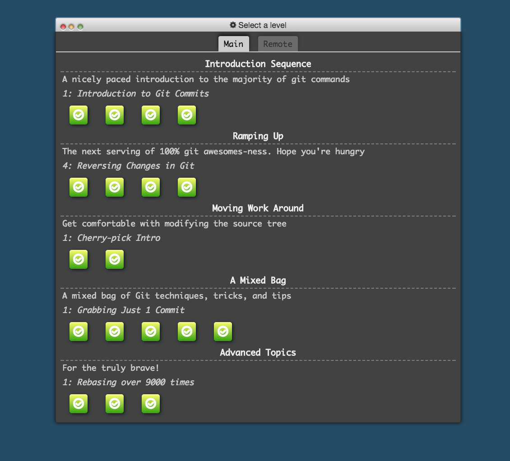

# HW0
HW0 for CSC 519 - DevOps

- Complete moodle and slack profiles by deadline <br />
[Slack](https://cscdevops-fall2017.slack.com/team/zsthampi) <br />
[Moodle](https://moodle-courses1718.wolfware.ncsu.edu/user/profile.php?id=117158) <br />

- Screenshot of completed git tutorial <br />

- Hooks

```
#!/bin/sh
#
# Open a web page immediately after a commit is performed

open http://google.com/
```
- Screencast
[Screencast Youtube Link](https://youtu.be/VKezNynltYA)

- Concepts
  * Continuous Integration is a practice where developers automatically build, test, and analyze a software change in response to every change (or commit) in the source code repository <br />
  Continuous Delivery takes into account the subtle differences in environments too. For instance, it makes sure the code is ready to work on Development, Test and Production environments. However, it does not deploy the code to the Production(Client) environments  <br />
  Continuous Deployment is when the software changes are automatically tested, analyzed and deployed to the Production environments. They are deployed to client environments in the process.  <br />
  * In a DevOps team model, feature owners (developers) work on a feature and support it till it is reasonably stable. After that, the responsibility of the feature shifts to a Site Reliability Engineer. <br />
  In a NoOps team model, feature owners (developers) are responsible for a feature from conception till the end. They provide support for all and any issues on their features. <br />
  NoOps model requires infrastructure to facilitate continuous deployment cycles. As there is no Operations team, the development teams are responsible for the complete lifecycle of the code. This in turns puts focus on tools to automate, and monitor the deployment cycles. Designing features as micro-services, and often extensive configuration steps are part of the infrastructure. 
  * The idea behind Every Feature is an Experiment is to update/modify features based on continous feedback from usage statstics. Along with pushing the features, it also includes code (and tools) to capture data from the users - such as how often the features were used, or what attributes of the feature performed better, etc. This helps to get a more precise estimate of the effectiveness of the feature. The feature may even be scrapped if it is not found effective, even after multiple modification attempts.
  * It follows the process of hiding updates on an application from the user (using methods like feature flags). It offers the ability to test how a new feature might work on Production like environments, without actually breaking any functionality. The features are only released to customers when sufficient testing is complete. Thus, the developers are free to collect statistics and actual data on the potential use of the features (which run on the background without the user realizing it), and catch issues early in the development cycle. 
